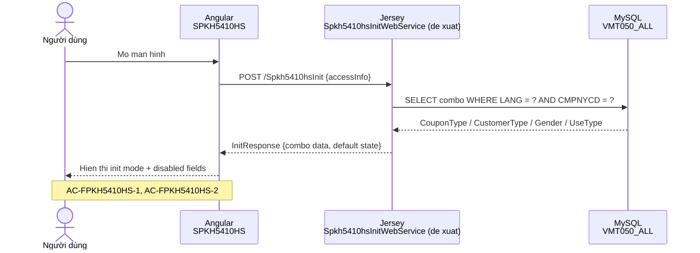
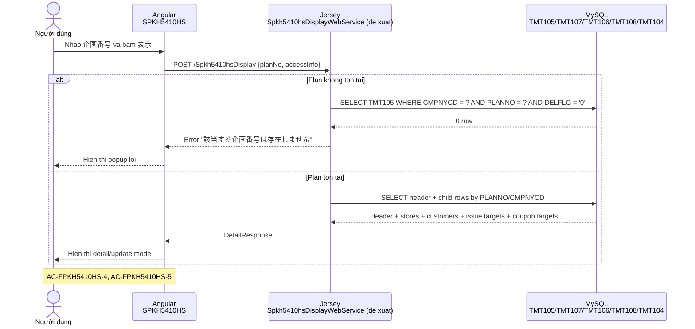
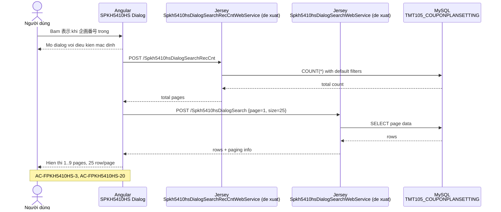
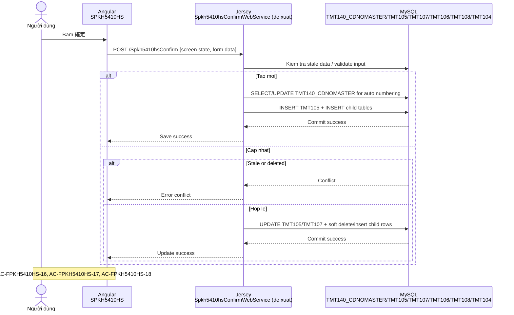
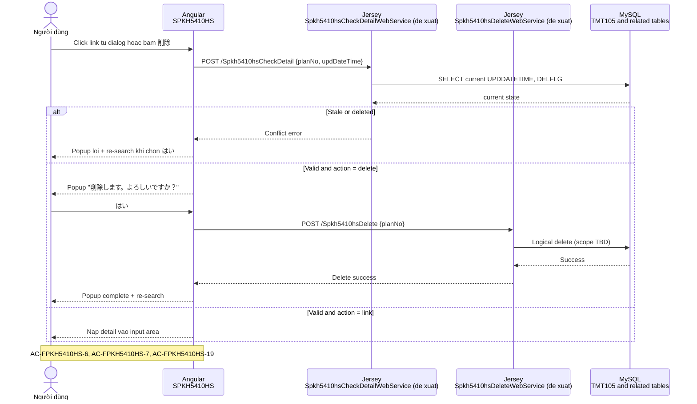

# Spec Pack - FPKH5410HS / SPKH5410HS / クーポン企画マスタ

| Item | Value |
|---|---|
| Ticket | `FPKH5410HS` |
| Screen ID | `SPKH5410HS` |
| Screen name | `クーポン企画マスタ` |
| Nguồn nghiệp vụ chính | `document_init/FPKH5410HS/spkh5410hs.md` |
| Nguồn format/rule | `.claude/rules/05-spec-pack.md`, `document_init/20_SDDInitial Installation Pack_02_Prompt.md` |

## 1. Background / Mục tiêu

Màn hình `SPKH5410HS` dùng để quản lý master “coupon plan” cho hệ thống CRM đa công ty. Theo tài liệu nguồn, màn hình phải hỗ trợ:

- tham chiếu chi tiết coupon plan đã đăng ký,
- tạo mới coupon plan,
- cập nhật coupon plan,
- xóa coupon plan đã đăng ký,
- lưu/cấu hình tập cửa hàng áp dụng,
- lưu tập khách hàng phát hành mục tiêu,
- lưu tập sản phẩm phát hành mục tiêu,
- lưu tập sản phẩm mục tiêu của coupon,
- cấu hình điều khiển hiển thị/in trên POS và receipt,
- sao chép (流用) từ coupon plan đã tồn tại sang plan mới,
- chuẩn bị nút “即時反映” để phản ánh khẩn lên POS.

Mục tiêu của spec pack này là biến tài liệu thiết kế rời rạc hiện có thành đặc tả có thể review/test được, đồng thời cô lập toàn bộ điểm còn mơ hồ sang `Open Issues`.

## 2. Scope

### 2.1 In scope

- Màn hình chính `SPKH5410HS` ở các trạng thái: init, detail/update, copy/new.
- Dialog danh sách coupon plan mở từ nút `表示` khi `企画番号` để trống.
- Các hành vi chính: `表示`, `クリア`, click link ở danh sách, `削除`, `確定`, `流用(コピー)`, `即時反映`, `カレンダー`, `一覧`, `ファイルの選択`.
- Điều khiển enable/disable theo:
  - `クーポン種類`,
  - `クーポン発行`,
  - `顧客区分`,
  - loại `対象指定` cho hai vùng danh sách mã.
- Đọc/ghi dữ liệu liên quan đến các bảng:
  - `TMT105_COUPONPLANSETTING`
  - `TMT107_COUPONPLANSTORESETTING`
  - `TMT106_COUPONTARGETCSTM`
  - `TMT108_COUPONISSUETARGETPRODUCT`
  - `TMT104_COUPONTARGETPLANPRODUCT`
  - `TMT140_CDNOMASTER_CDNOMASTER`
- Các bảng master phục vụ validate/lookup:
  - `TMT003_STORE`
  - `TMT026_PRODUCT`
  - `TMT010_GSMALLCLASSIFICATION`
  - `TMT100_CUSTOMER`
  - `VMT050_ALL`
  - `TMT002_USER`

### 2.2 Out of scope

- Logic tích hợp thật của `即時反映` lên POS.
- Thiết kế lại schema DB cho các field đang “調整待ち”.
- Quyết định UI/UX chi tiết cho phần chưa có source chắc chắn:
  - multi-store summary trên màn hình chính,
  - vị trí/nội dung của nút copy clipboard,
  - layout chi tiết của dialog danh sách.
- Tạo SQL artifact `tmt340_formitemnm.sql` khi chưa có `SEQNO` và `CMPNYCD` chính thức.
- Bất kỳ suy đoán nào vượt ngoài `spkh5410hs.md`.

## 3. Glossary

| JP | VN | EN | Ghi chú |
|---|---|---|---|
| 企画番号 | Số kế hoạch | Plan Number | Khóa nhận diện coupon plan |
| 企画名称 | Tên kế hoạch | Plan Name | Tên hiển thị của coupon plan |
| 自動採番 | Tự động đánh số | Auto numbering | Placeholder cho mode tạo mới |
| クーポン種類 | Loại coupon | Coupon Type | Nguồn nêu ít nhất `販促`, `メッセージ` |
| クーポン発行 | Phát hành coupon | Coupon Issue Flag | `あり / なし` |
| 顧客区分 | Phân loại khách hàng | Customer Segment | Điều khiển vùng chọn khách hàng |
| 会員コード指定 | Chỉ định mã hội viên | Member Code Specific | Bật vùng nhập mã khách hàng |
| 発行対象コード | Mã đối tượng phát hành | Issue Target Code | Sản phẩm hoặc mã tiểu loại |
| クーポン対象コード | Mã đối tượng coupon | Coupon Target Code | Sản phẩm hoặc mã tiểu loại |
| 小分類コード | Mã tiểu loại | Small Classification Code | Tra cứu từ `TMT010` |
| POS画面表示・レシート印字制御 | Điều khiển hiển thị POS / in receipt | POS / Receipt Display Control | Vùng cấu hình hành vi hiển thị/in |
| レシート有効期間 | Thời hạn hiệu lực receipt | Receipt Validity Period | `期間` hoặc `発行後` |
| 利用種別 | Loại sử dụng | Usage Type | Giảm tiền / giảm giá / point... |
| 流用(コピー) | Sao chép / dùng lại | Copy / Reuse | Tạo plan mới từ plan hiện tại |
| 即時反映 | Phản ánh ngay | Immediate Reflect | Chưa có logic tích hợp thật |
| 削除フラグ | Cờ xóa logic | Soft Delete Flag | `DELFLG = '1'` |
| 更新日時 | Ngày giờ cập nhật | Update Timestamp | Dùng cho kiểm tra xung đột |

## 4. As-Is / To-Be

| Chủ đề | As-Is | To-Be trong spec pack |
|---|---|---|
| Nguồn yêu cầu | Chỉ có 1 file thiết kế chi tiết trong `document_init/` | Chuyển thành spec có AC, examples, diagrams, traceability |
| Độ rõ của UI | Có 1 wireframe ASCII chính và mô tả thao tác | Tách rõ init/detail/dialog và rule enable/disable |
| Độ rõ của DB mapping | Có query/update SQL nhưng còn placeholder và mismatch | Ghi rõ phần chốt được, phần nào đưa sang Open Issues |
| Dialog danh sách | Có mô tả hành vi + paging, chưa có layout/API chi tiết | Chốt behavior tối thiểu và khóa phần thiếu |


## 5. Spec chi tiết

### 5.1 Actor và preconditions

- Actor chính: người dùng nội bộ có quyền truy cập màn hình master coupon plan.
- Mọi request phải chạy trong context `CMPNYCD` hiện tại của session.
- `LANG` hiện tại được dùng khi load combo từ `VMT050_ALL`.
- Các master `TMT003/TMT026/TMT010/TMT100` phải tồn tại để phục vụ lookup/validate.

### 5.2 Trạng thái màn hình

| Trạng thái | Trigger | Mô tả |
|---|---|---|
| Init | Mở màn hình lần đầu hoặc clear về mặc định | `企画番号` hiển thị `自動採番`, nhiều field ở trạng thái disable |
| Detail/Update | `表示` với `企画番号` hợp lệ hoặc click link từ danh sách | Tải dữ liệu header + child lists + audit info; hiển thị `削除` |
| Copy/New | `流用(コピー)` từ plan đang hiển thị | Chỉ `企画番号` trở về `自動採番`, phần còn lại giữ nguyên, confirm sẽ insert |
| Dialog list | `表示` khi `企画番号` trống | Mở popup tra cứu coupon plan, có paging 25 records/page |
| Error/Refresh | Dữ liệu đã bị cập nhật/xóa bởi tiến trình khác | Hiển thị popup lỗi, chọn `はい` thì re-search và refresh kết quả |

### 5.3 Wireframe ASCII - Init state

```text
+-------------------------------------------------------------------------------------------------------------------+
| クーポン企画マスタ                                                                                                |
|                                                                                                                   |
| 登録ユーザー名: [          ]  登録日時: [          ]       更新ユーザー名: [          ]  更新日時: [          ]   |
| 企画番号*:   [ 自動採番 ] [🔎]                             企画実施期間*: [ YYYY/MM/DD ] [📅] ～ [ YYYY/MM/DD ] [📅] | [▶ 表示] [▶ クリア] [▶ コピー] |
| 企画名称*:   [                                        ]    クーポン種類*: [ 販促 |v]                              |
|                                                            クーポン発行:  (o)あり  ( )なし                        |
+-----------------------------------------------------------+-------------------------------------------------------+
| 【対象店舗】                                              | 【POS画面表示・レシート印字制御】                     |
|  +-----------------------------------------------------+  |  POS反映回数:    (o)1回のみ        ( )継続            |
|  |店舗コード🔎| 店舗名称              | 停止 | 停止日  |  |  表示印字設定:   (o)画面のみ        ( )レシートのみ    |
|  |------------|-----------------------|------|---------|  |  確認後削除日数: (o)確認日削除      ( )期間終了日削除  |
|  |            |                       | [ ]  | [    ]📅|  |  確認済マーク:   (o)表示あり        ( )表示なし        |
|  |            |                       | [ ]  | [    ]📅|  |                                                       |
|  +-----------------------------------------------------+  | 【クーポン対象設定】                                  |
|                                                           |  対象指定: ( )指定なし (o)商品コード ( )小分類コード  |
| 【クーポン発行対象顧客選択】                              |  対象コード: [             ] [▶ 追加] [▶ 削除]        |
|  クーポン発行対象顧客区分: [ 会員 |v]                     |  +-------------------------------------------------+  |
|                                                           |  | 選択[ ] | 対象コード     | 対象名               |  |
|  性別: [ 女性 |v]   年齢: [   ] ～ [   ]                  |  |---------|----------------|----------------------|  |
|  誕生月: [ ]1月 [ ]2月 [ ]3月 [ ]4月 [ ]5月 [ ]6月        |  |   [ ]   |                |                      |  |
|          [ ]7月 [ ]8月 [ ]9月 [ ]10月 [ ]11月 [ ]12月     |  +-------------------------------------------------+  |
|  顧客カード番号: [             ] [▶ 追加] [▶ 削除]        |                                                       |
|  +-----------------------------------------------------+  | 【POS画面表示・レシート印字情報】                     |
|  | 選択[ ] | 顧客カード番号   | 顧客名                 |  |  レシート有効期間: (o)期間       ( )発行後            |
|  |---------|------------------|------------------------|  |  [ YYYY/MM/DD ] [📅] ～ [ YYYY/MM/DD ] [📅]           |
|  |   [ ]   |                  |                        |  |  利用種別: [ 値引 |v] [        ] 円                 |
|  +-----------------------------------------------------+  |  アイテム数: [  ]                                     |
|                                                           |  バーコード印字: (o)あり ( )なし                      |
| 【クーポン発行対象設定】                                  |  メッセージ表示1行目: [                             ] |
|  発行対象指定: ( )指定なし (o)商品コード ( )小分類コード  |  メッセージ表示2行目: [                             ] |
|  発行区分指定: ( )対象商品1つ購入 (o)購入金額             |  メッセージ表示3行目: [                             ] |
|  購入金額: [        ] 円以上                              |  メッセージ表示4行目: [                             ] |
|  発行対象コード: [             ] [▶ 追加] [▶ 削除]        |  メッセージ表示5行目: [                             ] |
|  +-----------------------------------------------------+  |  メッセージ表示6行目: [                             ] |
|  | 選択[ ] | 発行対象コード   | 発行対象名             |  |  メッセージ表示7行目: [                             ] |
|  |---------|------------------|------------------------|  |  (※最大10行目まで)                                   |
|  |   [ ]   |                  |                        |  |  イメージファイル: [ファイルの選択]                   |
|  +-----------------------------------------------------+  |                                                       |
+-----------------------------------------------------------+-------------------------------------------------------+
| [▶ 確定]      背景色が赤色表示となっている行はエラーとなります。正しい内容に修正してください。         [▶ 即時反映] |
+-------------------------------------------------------------------------------------------------------------------+
```

Ghi chú:

- Các field được source ghi rõ là disable ở init phải ở trạng thái non-editable.
- `削除` chưa xuất hiện ở init mode.
- Nút `クリップボードにコピー` được mô tả trong source nhưng không xuất hiện trong wireframe, nên đang để `Open Issue`.

### 5.4 Wireframe ASCII - Detail / Update mode

```text
+-------------------------------------------------------------------------------------------------------------------+
| クーポン企画マスタ                                                                                                |
|                                                                                                                   |
| 登録ユーザー名: [          ]  登録日時: [          ]       更新ユーザー名: [          ]  更新日時: [          ]   |
| 企画番号*:   [■  99999  ■] [🔎]                            企画実施期間*: [■2026/01/01■][📅] ～ [ 2026/01/31 ] [📅] | [▶ 表示] [▶ クリア] [▶ コピー] |
| 企画名称*:   [ テスト企画                             ]    クーポン種類*: [■  販促  |v■]                          |
|                                                            クーポン発行:  (●)あり  ( )なし   (※非活性)            |
+-----------------------------------------------------------+-------------------------------------------------------+
| 【対象店舗】                                              | 【POS画面表示・レシート印字制御】                     |
|  +-----------------------------------------------------+  |  POS反映回数:    (o)1回のみ        ( )継続            |
|  |店舗コード🔎| 店舗名称              | 停止 | 停止日  |  |  表示印字設定:   ( )画面のみ        (o)レシートのみ    |
|  |------------|-----------------------|------|---------|  |  確認後削除日数: (o)確認日削除      ( )期間終了日削除  |
|  | 00001      | ハシドラッグ八木田店  | [ ]  | [    ]📅|  |  確認済マーク:   (o)表示あり        ( )表示なし        |
|  | 00002      | ハシドラッグ西店      | [x]  | [26/1/25]📅|                                                       |
|  +-----------------------------------------------------+  | 【クーポン対象設定】                                  |
|                                                           |  対象指定: (o)指定なし ( )商品コード ( )小分類コード  |
| 【クーポン発行対象顧客選択】                              |  対象コード: [             ] [▶ 追加] [▶ 削除]        |
|  クーポン発行対象顧客区分: [ 全顧客 |v]                   |  +-------------------------------------------------+  |
|                                                           |  | 選択[ ] | 対象コード     | 対象名               |  |
|  性別: [■      |v■] 年齢: [■  ■] ～ [■  ■]              |  |---------|----------------|----------------------|  |
|  誕生月: [■]1月 [■]2月 [■]3月 [■]4月 [■]5月 [■]6月        |  |         |                |                      |  |
|          [■]7月 [■]8月 [■]9月 [■]10月 [■]11月 [■]12月     |  +-------------------------------------------------+  |
|  顧客カード番号: [■            ■] [▶ 追加] [▶ 削除]       |                                                       |
|  +-----------------------------------------------------+  | 【POS画面表示・レシート印字情報】                     |
|  | 選択[ ] | 顧客カード番号   | 顧客名                 |  |  レシート有効期間: (o)期間       ( )発行後            |
|  |---------|------------------|------------------------|  |  [■2026/01/01■][📅] ～ [ 2026/01/31 ] [📅]           |
|  |         |                  |                        |  |  利用種別: [ 値引 |v] [   200    ] 円                 |
|  +-----------------------------------------------------+  |  アイテム数: [■ ■]                                    |
|                                                           |  バーコード印字: (o)あり ( )なし                      |
| 【クーポン発行対象設定】                                  |  メッセージ表示1行目: [ テスト                      ] |
|  発行対象指定: ( )指定なし ( )商品コード (o)小分類コード  |  メッセージ表示2行目: [                             ] |
|  発行区分指定: ( )対象商品1つ購入 (o)購入金額             |  メッセージ表示3行目: [                             ] |
|  購入金額: [   1000   ] 円以上                            |  メッセージ表示4行目: [                             ] |
|  発行対象コード: [             ] [▶ 追加] [▶ 削除]        |  メッセージ表示5行目: [                             ] |
|  +-----------------------------------------------------+  |  メッセージ表示6行目: [                             ] |
|  | 選択[ ] | 発行対象コード   | 発行対象名             |  |  メッセージ表示7行目: [                             ] |
|  |---------|------------------|------------------------|  |  (※最大10行目まで)                                   |
|  |         |                  |                        |  |  イメージファイル: [ファイルの選択]                   |
|  +-----------------------------------------------------+  |                                                       |
+-----------------------------------------------------------+-------------------------------------------------------+
| [▶ 確定]      背景色が赤色表示となっている行はエラーとなります。正しい内容に修正してください。         [▶ 即時反映] |
+-------------------------------------------------------------------------------------------------------------------+
```

Ghi chú:

- Phần audit info là suy ra từ detail query của `TMT105` có `ENTUSRNM/ENTDATETIME/UPDUSRNM/UPDDATETIME`.
- `削除` chỉ xuất hiện khi đang hiển thị một record đã tồn tại.

### 5.5 Wireframe ASCII - Coupon plan list dialog

```text
+-----------------------------------------------------------------------------------------------+
| クーポン企画一覧                                                                              |
|  検索条件                                                                                     |
|   企画番号: [          ]  企画名: [                          ]                                 |
|   登録日: [ system-31d ] [カレンダー] ～ [ system date ] [カレンダー]                          |
|                                                     [ クリア ] [ 表示 ] [ 閉じる ]             |
|                                                                                               |
|  +-----------------------------------------------------------------------------------------+  |
|  | 企画番号 | 企画名 | クーポン種類 | クーポン発行 | 更新日時 | 流用(コピー) |               |  |
|  +-----------------------------------------------------------------------------------------+  |
|  | 000123   | 春の販促クーポン | 販促 | あり | 2026/03/20 14:15:10 | [流用] |               |  |
|  +-----------------------------------------------------------------------------------------+  |
|                                                                                               |
|  件数: 25件   1 2 3 4 5 6 7 8 9                                                               |
+-----------------------------------------------------------------------------------------------+
```

Ghi chú:

- Layout này là wireframe tối thiểu do spec pack dựng lại từ mô tả hành vi của nguồn; cột chi tiết vẫn là `Open Issue`.
- Link `企画番号` phải hỗ trợ click để đưa dữ liệu về màn hình chính.

### 5.6 Hành vi chi tiết

#### 5.6.1 Khởi tạo màn hình

- Khi mở màn hình, `企画番号` hiển thị placeholder `自動採番`.
- Khi focus vào `企画番号`, placeholder bị xóa để cho phép nhập tay.
- Nếu blur ra mà không nhập gì, giá trị quay lại `自動採番`.
- Các field phải disable ở init:
  - `性別`, `年齢`, `誕生月`, `顧客カード番号`
  - `購入金額`, `発行対象コード`
  - `確認後削除日数`, `確認済マーク`
  - `クーポン対象設定` của `対象コード`
  - `アイテム数`
- Các item khác ở trạng thái chưa chọn/chưa nhập.

#### 5.6.2 Nút `クリア`

- Nếu không có thay đổi hoặc không có dữ liệu cần giữ, màn hình trở về trạng thái init.
- Nếu có thay đổi chưa lưu:
  - hiển thị popup xác nhận,
  - chọn `はい` thì reset toàn bộ về init,
  - chọn `いいえ` thì đóng popup và giữ nguyên trạng thái trước đó.
- Cụm từ “新規追加を制御する” trong nguồn chưa đủ rõ; spec hiện coi đây là reset về trạng thái init/new-entry, nhưng vẫn giữ thành `Open Issue` để business xác nhận.

#### 5.6.3 Nút `表示`

- Nếu `企画番号` có giá trị:
  - validate tồn tại trên `TMT105_COUPONPLANSETTING`,
  - nếu không tồn tại, hiển thị lỗi “該当する企画番号は存在しません”,
  - nếu tồn tại, load dữ liệu header và các child list từ các bảng liên quan rồi hiển thị trên màn hình.
- Nếu `企画番号` trống:
  - coi như người dùng yêu cầu mở dialog danh sách coupon plan,
  - dialog tự động search với điều kiện mặc định.

#### 5.6.4 Click link ở kết quả danh sách

- Trước khi nạp dữ liệu vào input area, hệ thống phải kiểm tra record có bị cập nhật hoặc bị xóa bởi tiến trình khác hay không.
- Nếu `UPDDATETIME` đã thay đổi hoặc `DELFLG` đã bật:
  - hiển thị popup lỗi,
  - chọn `はい` thì re-search và hiển thị lại danh sách.
- Nếu record vẫn hợp lệ:
  - đổ dữ liệu vào input area,
  - chuyển sang mode detail/update,
  - hiển thị nút `削除`.

#### 5.6.5 Nút `削除` trên màn hình chính

- Trước khi xóa, hệ thống phải thực hiện cùng loại stale-data check như khi click link.
- Nếu record đã stale hoặc đã bị xóa ở nơi khác:
  - hiển thị lỗi,
  - chọn `はい` thì re-search danh sách.
- Nếu record còn hợp lệ:
  - hiển thị popup “削除します。よろしいですか？”,
  - khi người dùng xác nhận, thực hiện xóa logic,
  - hiển thị popup hoàn tất,
  - re-search và hiển thị lại kết quả.
- Phạm vi xóa logic ở DB chưa được chốt trong nguồn.

#### 5.6.6 Nút `カレンダー`

- Nếu field date tương ứng đang trống:
  - popup calendar mở ở tháng/năm chứa system date,
  - ngày chưa được chọn trước.
- Nếu field date đã có giá trị:
  - popup calendar mở đúng tháng/năm của giá trị đang hiển thị,
  - ngày đang có giá trị phải ở trạng thái selected.

#### 5.6.7 Nút `🔍（一覧）`

- Ở vùng cửa hàng, click nút mở màn hình chọn nhiều cửa hàng.
- Nguồn xác nhận đây là multi-store selector, nhưng cách phản ánh kết quả về màn hình chính chưa được chốt.

#### 5.6.8 Vùng `クーポン発行対象顧客選択`

- `顧客区分` điều khiển enable/disable:
  - `会員コード指定`: enable vùng nhập `顧客カード番号` và nút `追加`,
  - `会員`: enable `性別`, `年齢`, `誕生月`,
  - các giá trị khác: disable các field liên quan.
- Người dùng có thể duy trì danh sách `顧客カード番号` trên màn hình.
- Dữ liệu danh sách được load từ `TMT106_COUPONTARGETCSTM`.
- Exact timing của validate tồn tại customer code chưa được nguồn chốt rõ.

#### 5.6.9 Vùng `クーポン発行対象設定`

- `対象指定` chỉ cho phép chọn một trong hai:
  - `商品コード`
  - `小分類コード`
- Nút `追加`:
  - kiểm tra input bắt buộc,
  - kiểm tra tồn tại master,
  - nếu hợp lệ thì thêm mã vào list trên màn hình.
- Nút `削除`:
  - yêu cầu ít nhất một dòng có check xóa,
  - chỉ loại khỏi list hiển thị trên màn hình; việc xóa logic ở DB xảy ra tại `確定`.
- Hỗ trợ drag & drop text/file để import nhiều mã, delimiter chấp nhận:
  - xuống dòng,
  - dấu phẩy,
  - tab.
- `発行区分指定` và `購入金額` chưa có DB mapping chốt nên chưa được đặc tả chi tiết hơn.

#### 5.6.10 Vùng `クーポン対象設定`

- Cùng pattern với vùng phát hành mục tiêu:
  - chọn loại mã theo `商品コード / 小分類コード`,
  - `追加` sau validate,
  - `削除` chỉ loại khỏi list trên màn hình trước khi confirm,
  - hỗ trợ drag & drop text/file.
- Điểm chưa chốt:
  - có dùng chung field `COUPONTARGETPRODUCT` với vùng phát hành mục tiêu hay không.

#### 5.6.11 Nút `ファイルの選択`

- Mở file picker theo chuẩn của OS/browser hiện hành.
- Sau khi chọn, hiển thị tên/đường dẫn file trong field `イメージファイル`.
- Loại file, giới hạn dung lượng, cách lưu file thật chưa có trong nguồn.

#### 5.6.12 Nút `クリップボードにコピー`

- Mô tả nguồn nói “copy toàn bộ giá trị của bảng”.
- Do không có vị trí nút và bảng đích trong wireframe, spec chỉ chốt rằng đây là hành vi copy dữ liệu dạng tabular sang clipboard; chi tiết UI/target table giữ ở `Open Issue`.

#### 5.6.13 Nút `確定`

- Khi `企画番号` đang ở trạng thái `自動採番`, xử lý như tạo mới:
  - cấp số từ `TMT140_CDNOMASTER`,
  - insert header plan,
  - insert child data,
  - lưu audit columns.
- Khi `企画番号` là record có sẵn, xử lý như update:
  - stale-data check trước khi ghi,
  - update header,
  - cập nhật child data theo diff/soft delete.
- Trước khi lưu phải chạy validation theo từng field:
  - required,
  - digit length,
  - date validity,
  - range validity,
  - duplicate check.
- Ma trận validation chi tiết hiện chưa có.

#### 5.6.14 Điều khiển theo `クーポン種類`

- Nếu `クーポン種類 = メッセージ`:
  - `クーポン発行` bị cố định ở `なし`,
  - lựa chọn `あり` bị disable.
- Nếu `クーポン種類 = 販促`:
  - người dùng có thể chọn `あり / なし`.

#### 5.6.15 Điều khiển theo `クーポン発行 = なし`

- Trường hợp `販促 x 発行なし`:
  - disable vùng phát hành mục tiêu khách hàng,
  - disable vùng phát hành mục tiêu sản phẩm,
  - disable khoảng thời gian thực hiện plan,
  - disable display/print settings,
  - disable barcode print,
  - disable messages,
  - disable image file.
- Trường hợp `メッセージ x 発行なし`:
  - disable vùng coupon target,
  - disable receipt validity,
  - disable usage type,
  - disable barcode print.

#### 5.6.16 Nút `流用(コピー)`

- Chỉ khả dụng khi đang có dữ liệu plan trên màn hình.
- Nếu chưa có plan nào được load, phải báo lỗi.
- Khi copy:
  - chỉ `企画番号` chuyển về `自動採番`,
  - mọi field còn lại giữ nguyên,
  - màn hình chuyển sang mode tạo mới,
  - `確定` sau đó phải đi theo nhánh insert.

#### 5.6.17 Nút `即時反映`

- Chỉ áp dụng cho plan đã được đăng ký.
- Khi bấm, màn hình phải khởi tạo flow phản ánh khẩn lên POS.
- Vì nguồn nói rõ logic liên kết “sẽ bổ sung sau”, spec hiện chỉ chốt sự tồn tại của trigger này, chưa chốt API/result contract.

#### 5.6.18 Chuyển đổi `対象指定`

- Cho mỗi vùng list mã, `商品コード` và `小分類コード` là lựa chọn loại trừ nhau.
- Nếu người dùng đổi loại sau khi đã có dữ liệu:
  - hiển thị popup xác nhận clear dữ liệu cũ,
  - đồng ý thì xóa list hiện có và chuyển loại,
  - từ chối thì giữ nguyên loại cũ và dữ liệu cũ.

#### 5.6.19 Dialog danh sách coupon plan

- Init dialog:
  - `企画番号`, `企画名` trống,
  - `登録日(開始)` mặc định = system date - 31 ngày,
  - `登録日(終了)` mặc định = system date,
  - tự động search với điều kiện mặc định.
- Các thao tác phải có:
  - `表示`,
  - `クリア`,
  - `カレンダー`,
  - click anchor `企画番号`,
  - `流用（コピー）`,
  - `閉じる`.

#### 5.6.20 Paging

- Số record tối đa mỗi trang: `25`.
- Không giới hạn tổng số trang.
- Nếu số trang >= 10:
  - mặc định hiển thị `1..9`,
  - khi bấm trang `9`, window trượt thành `5..13`,
  - ví dụ nguồn nêu thêm khi bấm trang `13`, window hiển thị `9..17`.
- Trang đang active hiển thị không gạch chân.

## 6. Data requirements

### 6.1 Bảng và vai trò

| Bảng | Vai trò | R/W | Ghi chú |
|---|---|---|---|
| `TMT105_COUPONPLANSETTING` | Header chính của coupon plan | R/W | Lưu tên plan, thời gian, loại coupon, issue flag, receipt settings, audit |
| `TMT107_COUPONPLANSTORESETTING` | Cửa hàng áp dụng | R/W | Query hiện cho phép nhiều dòng theo `PLANNO` |
| `TMT106_COUPONTARGETCSTM` | Danh sách khách hàng mục tiêu | R/W | Soft delete khi bỏ chọn/xóa |
| `TMT108_COUPONISSUETARGETPRODUCT` | Danh sách sản phẩm phát hành mục tiêu | R/W | Phân nhánh theo product/small-class |
| `TMT104_COUPONTARGETPLANPRODUCT` | Danh sách sản phẩm mục tiêu coupon | R/W | Phân nhánh theo product/small-class |
| `TMT140_CDNOMASTER` | Master cấp số | R/W | Dùng cho auto numbering khi tạo mới |
| `VMT050_ALL` | Combo master | R | Dùng cho coupon type, target type, gender, usage type |
| `TMT003_STORE` | Store master | R | Lookup tên cửa hàng |
| `TMT026_PRODUCT` | Product master | R | Lookup tên sản phẩm |
| `TMT010_GSMALLCLASSIFICATION` | Small classification master | R | Lookup tên tiểu loại |
| `TMT100_CUSTOMER` | Customer master | R | Lookup tên khách hàng |
| `TMT002_USER` | User master | R | Resolve `ENTUSRNM`, `UPDUSRNM` |

### 6.2 Read model

#### 6.2.1 Init

- Load combo từ `VMT050_ALL` theo:
  - `RCDKBN = 'xxx1'` cho `クーポン種類`
  - `RCDKBN = 'xxx2'` cho `クーポン発行対象顧客区分`
  - `RCDKBN = 'xxx3'` cho `性別`
  - `RCDKBN = 'xxx4'` cho `利用種別`
- Mọi query init phải filter theo `LANG` và `CMPNYCD`.

#### 6.2.2 Detail display theo `PLANNO`

- Header data đọc từ `TMT105_COUPONPLANSETTING`.
- Tên user tạo/cập nhật đọc qua `LEFT JOIN TMT002_USER`.
- Cửa hàng đọc từ `TMT107` + `TMT003`.
- Customer target đọc từ `TMT106` + `TMT100`.
- Issue target và coupon target đọc từ `TMT108` / `TMT104`, rồi resolve name qua `TMT026` hoặc `TMT010`.
- Tất cả query đều có:
  - `CMPNYCD = ?`
  - `DELFLG = '0'`
  - `PLANNO = ?`

#### 6.2.3 Dialog list

- Nguồn chỉ mô tả điều kiện search và paging.
- API/query chi tiết cho dialog list chưa có trong source; hiện để `Open Issue`.

### 6.3 Write model

#### 6.3.1 Tạo mới

Phần này là **suy luận bắt buộc từ nguồn**, vì source nêu rõ màn hình hỗ trợ “新規登録” và có `TMT140_CDNOMASTER` nhưng không đưa INSERT SQL.

- Lấy số plan mới từ `TMT140_CDNOMASTER`.
- Insert header vào `TMT105`.
- Insert child rows vào:
  - `TMT107`
  - `TMT106`
  - `TMT108`
  - `TMT104`
- Ghi audit columns:
  - `ENTUSRCD`
  - `ENTDATETIME`
  - `ENTPRG = 'FPKH5410HS'`
  - `UPDUSRCD`
  - `UPDDATETIME`
  - `UPDPRG = 'FPKH5410HS'`

#### 6.3.2 Cập nhật

Source đã cung cấp:

- `UPDATE TMT105_COUPONPLANSETTING`
- `UPDATE TMT107_COUPONPLANSTORESETTING`
- soft delete cho `TMT106`
- soft delete cho `TMT108`
- soft delete cho `TMT104`

Spec chốt thêm:

- Các item mới được thêm trên màn hình phải được insert khi confirm.
- Các item bị bỏ khỏi list trước khi confirm phải được chuyển sang soft delete tại thời điểm confirm.

#### 6.3.3 Xóa coupon plan

- Có hành vi xóa ở UI theo source.
- Nhưng source chưa cho SQL delete chính thức cho header/dependent data.
- Spec hiện chỉ chốt đây là **soft delete flow**; exact table scope giữ ở `Open Issue`.

### 6.4 Các mapping/chốt dữ liệu còn thiếu

| Chủ đề | Evidence | Trạng thái trong spec |
|---|---|---|
| `発行区分指定` | Detail query có `?' AS '?1'` | Blocker - chưa chốt cột DB |
| `購入金額` | Detail query có `?' AS '?2'` | Blocker - chưa chốt cột DB |
| `COUPONTARGETPRODUCT` | Cùng được dùng cho `TMT108` và `TMT104` | Blocker - chưa biết shared hay split |
| `RECEIPTLIMITDAY` | Có trong update SQL, không có trong detail query | Major - chưa chốt mapping round-trip |
| `IMAGEFILENM` | Có trong update SQL, không có query detail rõ ràng ngoài field hiển thị | Major - chưa chốt nguồn hiển thị detail |
| Delete scope | Chỉ có UI flow, thiếu SQL cho plan header/store | Major |
| Dialog list API | Chỉ có behavior text, không có SQL/action | Major |
| TMT340 SQL artifact | Thiếu SEQNO và CMPNYCD | Blocker |

### 6.5 SQL artifact status

- `docs/changes/FPKH5410HS/sql/tmt340_formitemnm.sql`: **chưa tạo**
  - lý do: chưa có `SEQNO` mapping chính thức,
  - chưa có `CMPNYCD` chuẩn để đóng script,
  - nếu tự tạo sẽ là suy đoán, trái rule “không bổ sung spec bằng phỏng đoán”.
- DDL bảng mới: **không cần ở thời điểm này**
  - vì nguồn chỉ tham chiếu các bảng đã tồn tại, chưa định nghĩa bảng mới.

## 7. Non-functional requirements

| Nhóm | Yêu cầu |
|---|---|
| Multi-tenancy | Mọi read/write phải gắn `CMPNYCD`; không được đọc/ghi chéo tenant |
| Soft delete | Record active phải dùng `DELFLG = '0'`; xóa theo hướng logical delete |
| Concurrency | Các flow mở detail, xóa, cập nhật phải kiểm tra stale data qua `UPDDATETIME` và trạng thái xóa |
| Audit | Header phải hiển thị người tạo/cập nhật và thời điểm tương ứng; save/delete phải cập nhật audit columns |
| Performance | Dialog danh sách phải phân trang 25 records/page; tránh load all records ở màn hình chính |
| Security | Không log PII ngoài mức cần thiết; validate input trước khi ghi DB; lookup phải kiểm tra master tồn tại |
| I18n | Combo labels phải theo `LANG`; message text nên lấy từ message resources của hệ thống |
| File handling | File picker dùng chuẩn OS/browser; validate kiểu file/kích thước còn chờ chốt |
| UX consistency | Popup xác nhận phải xuất hiện ở clear/delete/switch target type/các điểm có nguy cơ mất dữ liệu |

## 8. Acceptance Criteria

| ID | Điều kiện | Kết quả mong đợi |
|---|---|---|
| **AC-FPKH5410HS-1** | Người dùng mở màn hình lần đầu | Màn hình hiển thị ở init mode, `企画番号` là `自動採番`, các field phải-disable đúng theo source |
| **AC-FPKH5410HS-2** | Người dùng focus rồi blur khỏi `企画番号` mà không nhập gì | Placeholder `自動採番` được khôi phục |
| **AC-FPKH5410HS-3** | Người dùng bấm `表示` khi `企画番号` trống | Hệ thống mở dialog danh sách coupon plan với điều kiện mặc định |
| **AC-FPKH5410HS-4** | Người dùng bấm `表示` với `企画番号` không tồn tại | Hệ thống hiển thị lỗi “該当する企画番号は存在しません” và không thay đổi màn hình hiện tại |
| **AC-FPKH5410HS-5** | Người dùng bấm `表示` với `企画番号` hợp lệ | Hệ thống tải header, store setting, customer target, issue target, coupon target và audit info của plan đó |
| **AC-FPKH5410HS-6** | Người dùng click link ở kết quả danh sách và record đã bị cập nhật/xóa bởi xử lý khác | Hệ thống hiển thị lỗi stale data; chọn `はい` thì re-search và refresh danh sách |
| **AC-FPKH5410HS-7** | Người dùng click link ở kết quả danh sách và record vẫn hợp lệ | Hệ thống đổ dữ liệu vào input area và hiển thị nút `削除` |
| **AC-FPKH5410HS-8** | Người dùng bấm `クリア` khi không có thay đổi cần giữ | Màn hình trở về init mode mà không cần popup xác nhận |
| **AC-FPKH5410HS-9** | Người dùng bấm `クリア` khi có thay đổi chưa lưu | Hệ thống hiển thị popup xác nhận; `はい` thì reset, `いいえ` thì giữ nguyên dữ liệu |
| **AC-FPKH5410HS-10** | `クーポン種類 = メッセージ` | `クーポン発行` bị cố định ở `なし` và lựa chọn `あり` bị disable |
| **AC-FPKH5410HS-11** | `クーポン発行 = なし` | Các vùng liên quan bị disable đúng theo matrix của source, phụ thuộc vào `クーポン種類` |
| **AC-FPKH5410HS-12** | Người dùng đổi `顧客区分` | Vùng nhập khách hàng enable/disable đúng theo loại `会員コード指定 / 会員 / khác` |
| **AC-FPKH5410HS-13** | Người dùng thêm hoặc xóa dòng ở vùng `クーポン発行対象設定` | Hệ thống validate input, cập nhật list trên màn hình, và chỉ thực hiện soft delete ở DB tại thời điểm `確定` |
| **AC-FPKH5410HS-14** | Người dùng thêm hoặc xóa dòng ở vùng `クーポン対象設定` | Hệ thống validate input, cập nhật list trên màn hình, và chỉ thực hiện soft delete ở DB tại thời điểm `確定` |
| **AC-FPKH5410HS-15** | Người dùng thực hiện drag & drop text/file vào hai vùng danh sách mã | Hệ thống tách nhiều mã theo xuống dòng, dấu phẩy hoặc tab rồi thêm vào list tương ứng |
| **AC-FPKH5410HS-16** | Người dùng bấm `確定` ở mode tạo mới với dữ liệu hợp lệ | Hệ thống cấp số plan mới, lưu header + child data và cập nhật `TMT140_CDNOMASTER` |
| **AC-FPKH5410HS-17** | Người dùng bấm `確定` ở mode cập nhật nhưng record đã stale hoặc đã bị xóa | Hệ thống chặn lưu và yêu cầu người dùng refresh lại dữ liệu |
| **AC-FPKH5410HS-18** | Người dùng bấm `流用(コピー)` khi đang hiển thị một plan hợp lệ | Hệ thống chuyển sang mode tạo mới, chỉ reset `企画番号` về `自動採番`, giữ nguyên các field còn lại |
| **AC-FPKH5410HS-19** | Người dùng bấm `削除` cho plan hợp lệ và xác nhận xóa | Hệ thống hiển thị popup hoàn tất và re-search để danh sách không còn hiển thị plan đã xóa |
| **AC-FPKH5410HS-20** | Người dùng mở dialog danh sách có tổng số trang >= 10 | Dialog áp dụng paging 25 records/page và hiển thị window số trang kiểu trượt `1..9`, `5..13`, `9..17` như source mô tả |
| **AC-FPKH5410HS-21** | Người dùng bấm nút `カレンダー` tại một field ngày | Popup calendar mở ở tháng phù hợp; ngày hiện có được chọn sẵn nếu field đã có giá trị |

## 9. Examples

### 9.1 Normal paths

| ID | Tình huống | Kỳ vọng |
|---|---|---|
| N-01 | Người dùng nhập `企画番号 = 000123`, bấm `表示`, record tồn tại và còn hợp lệ | Màn hình chuyển sang detail/update mode, toàn bộ child lists được nạp, audit info hiển thị, `削除` xuất hiện |
| N-02 | Người dùng mở một plan hợp lệ, bấm `流用(コピー)`, đổi `企画名称`, rồi `確定` | Hệ thống tạo plan mới bằng auto numbering; dữ liệu còn lại được copy từ plan cũ |

### 9.2 Error paths

| ID | Tình huống | Kỳ vọng |
|---|---|---|
| E-01 | Người dùng nhập `企画番号` không tồn tại rồi bấm `表示` | Hệ thống hiển thị lỗi tồn tại plan number và không load dữ liệu giả |
| E-02 | Người dùng đang mở detail, nhưng record đã bị user khác cập nhật/xóa trước khi click link hoặc `削除` hoặc `確定` | Hệ thống chặn thao tác, báo stale data và buộc refresh/re-search |

### 9.3 Boundary cases

| ID | Tình huống | Kỳ vọng |
|---|---|---|
| B-01 | `企画番号` đang là `自動採番`, người dùng xóa trống rồi blur ra | Giá trị quay lại `自動採番`, không giữ trạng thái blank bất định |
| B-02 | Dialog danh sách có đúng 25 record / trang và người dùng chuyển từ page 8 sang page 9 | Trang 9 vẫn trả 25 record tối đa; window số trang đổi từ `1..9` sang `5..13` đúng mô tả |

## 10. Sequence diagrams

### 10.1 Init screen



### 10.2 Display by plan number



### 10.3 Search dialog and paging



### 10.4 Save new / update



### 10.5 Check link stale-data and delete



## 11. Open Issues

| Priority | ID | Câu hỏi cần chốt | Ảnh hưởng |
|---|---|---|---|
| Blocker | OI-01 | `発行区分指定` map vào cột/bảng nào? | Không thể chốt model dữ liệu, validate, API request/response |
| Blocker | OI-02 | `購入金額` map vào cột/bảng nào? | Không thể chốt save/update/read-back cho vùng phát hành mục tiêu |
| Blocker | OI-03 | `COUPONTARGETPRODUCT` là field dùng chung cho cả vùng phát hành mục tiêu và coupon target hay cần tách thành 2 field riêng? | Nếu hiểu sai sẽ dẫn tới ghi sai dữ liệu |
| Blocker | OI-04 | Khi xóa plan, cụ thể những bảng nào phải soft delete: chỉ `TMT105`, hay cả `TMT107/TMT106/TMT108/TMT104`? | Không thể code delete an toàn |
| Blocker | OI-05 | Cần cung cấp `SEQNO` mapping và `CMPNYCD` chuẩn nào để tạo `sql/tmt340_formitemnm.sql`? | Phase 1 chưa thể hoàn tất artifact SQL theo rule repo |
| Major | OI-06 | UI cuối cùng cho multi-store là summary 1 dòng, table nhiều dòng, hay popup-only? | Ảnh hưởng thiết kế FE và mapping `TMT107` |
| Major | OI-07 | Dialog danh sách cần hiển thị cột nào, có search theo trường nào, có dùng copy trực tiếp từ dialog hay không? | Ảnh hưởng AC, API search/count và UI |
| Major | OI-08 | `RECEIPTLIMITDAY` / `有効日数` phải đọc từ đâu và hiển thị thế nào ở detail mode? | Ảnh hưởng round-trip dữ liệu |
| Major | OI-09 | Validation matrix chi tiết cho từng field là gì: required, max length, numeric range, duplicate rules, date range rules, file constraints? | Không thể implement validation đầy đủ |
| Major | OI-10 | `顧客カード番号` validate tại lúc bấm `追加`, lúc `確定`, hay cả hai? | Ảnh hưởng UX và API design |
| Major | OI-11 | `即時反映` cần API nào, đồng bộ hay bất đồng bộ, thành công/thất bại phản hồi ra sao? | Chưa thể coi feature này sẵn sàng implement |
| Major | OI-12 | Nút `クリップボードにコピー` nằm ở đâu và copy bảng nào? | Không thể chốt wireframe/final UX |

## 12. Risks

| Risk | Tác động | Giảm thiểu |
|---|---|---|
| Mapping sai các field còn placeholder | Save/read-back sai dữ liệu nghiệp vụ | Chốt OI-01/OI-02 trước Phase 3 |
| Hiểu sai quan hệ giữa hai vùng target code | Ghi đè sai dữ liệu hoặc xóa nhầm | Chốt OI-03 và cập nhật spec trước khi lập impl-plan |
| Delete scope không rõ | Gây orphan data hoặc xóa thiếu/xóa thừa | Chốt OI-04 và bổ sung SQL/rollback ở phase sau |
| Multi-store UI không rõ | FE implement xong nhưng không dùng được thực tế | Chốt OI-06 bằng wireframe hoặc nguồn thiết kế bổ sung |
| Validation chưa đủ | Lỗi dữ liệu vào DB hoặc vòng review kéo dài | Lập ma trận validation riêng từ business/DB owner |
| Immediate reflect chưa có contract | Tạo nút nhưng không có hành vi hoàn chỉnh | Tách riêng scope tích hợp hoặc khóa button cho phase hiện tại |

## 13. Phụ lục - Màn hình tham khảo

| Pattern | Screen ID | Đường dẫn | Lý do tham khảo |
|---|---|---|---|
| CRUD Master cơ bản (P-01) | `SPKH5270HS` | `src/main/java/jp/co/brycen/kikancen/spkh5270hs*/` | Pattern CRUD master, soft delete, validate, detail mode |
| CheckLink / stale-data flow (P-08) | `SPKH5270HS` | `src/main/java/jp/co/brycen/kikancen/spkh5270hschecklink/` | Tham khảo click link vào detail/update mode |
| CheckDetail + confirm phức tạp (P-08/P-15) | `SPMT10101` | `src/main/java/jp/co/brycen/kikancen/spmt10101*/` | Tham khảo stale-data check, confirm trước thao tác nhạy cảm |
| FocusOut / lookup nhiều field (P-12) | `SPMT10101` | `src/main/webapp/angular/src/app/components/spmt10101/` | Tham khảo lookup mã -> tên cho store/product/customer |
| Dialog search + pager | `SPKH5270HS` hoặc `SPVW00151` | `src/main/webapp/angular/src/app/components/spkh5270hs/` | Tham khảo pattern count -> search -> pager |
| Chưa có pattern catalog rõ | `N/A` | `N/A` | Drag & drop mass code import, clipboard copy, immediate reflect cần chốt thêm |

## 14. Traceability table

| AC | Screen / Area | API / Action | DB / Table | Logs / Audit | Permissions | Test type |
|---|---|---|---|---|---|---|
| AC-FPKH5410HS-1 | Main screen init | `Spkh5410hsInit` (de xuat) | `VMT050_ALL` | N/A | Read screen auth (assumed) | FE UT, IT, E2E |
| AC-FPKH5410HS-2 | `企画番号` field | FE local event | N/A | N/A | Read screen auth (assumed) | FE UT, E2E |
| AC-FPKH5410HS-3 | `表示` -> dialog | `Spkh5410hsDialogSearchRecCnt/Search` (de xuat) | `TMT105` | N/A | Read screen auth (assumed) | IT, E2E, BB |
| AC-FPKH5410HS-4 | `表示` invalid | `Spkh5410hsDisplay` (de xuat) | `TMT105` | Error message only | Read screen auth (assumed) | IT, E2E, BB |
| AC-FPKH5410HS-5 | Main detail load | `Spkh5410hsDisplay` (de xuat) | `TMT105/TMT107/TMT106/TMT108/TMT104/TMT002` | Header audit columns | Read screen auth (assumed) | IT, E2E, BB |
| AC-FPKH5410HS-6 | Dialog result link stale check | `Spkh5410hsCheckDetail` (de xuat) | `TMT105` | Error popup | Read screen auth (assumed) | IT, E2E, BB |
| AC-FPKH5410HS-7 | Dialog result link valid | `Spkh5410hsCheckDetail` (de xuat) | `TMT105...` | Header audit columns | Read screen auth (assumed) | IT, E2E |
| AC-FPKH5410HS-8 | `クリア` no-change | FE local action | N/A | N/A | Update screen auth (assumed) | FE UT, E2E |
| AC-FPKH5410HS-9 | `クリア` changed | FE local action + popup | N/A | N/A | Update screen auth (assumed) | FE UT, E2E, BB |
| AC-FPKH5410HS-10 | Coupon type control | FE local action | N/A | N/A | Update screen auth (assumed) | FE UT, E2E |
| AC-FPKH5410HS-11 | Issue none control | FE local action | N/A | N/A | Update screen auth (assumed) | FE UT, E2E |
| AC-FPKH5410HS-12 | Customer segment control | FE local action | N/A | N/A | Update screen auth (assumed) | FE UT, E2E |
| AC-FPKH5410HS-13 | Issue target list | `Spkh5410hsConfirm` / master check (de xuat) | `TMT108/TMT026/TMT010` | Audit on save | Update screen auth (assumed) | FE UT, IT, E2E |
| AC-FPKH5410HS-14 | Coupon target list | `Spkh5410hsConfirm` / master check (de xuat) | `TMT104/TMT026/TMT010` | Audit on save | Update screen auth (assumed) | FE UT, IT, E2E |
| AC-FPKH5410HS-15 | Drag & drop import | FE parse + save action | `TMT108/TMT104` | Audit on save | Update screen auth (assumed) | FE UT, IT, E2E, BB |
| AC-FPKH5410HS-16 | Confirm new | `Spkh5410hsConfirm` (de xuat) | `TMT140_CDNOMASTER/TMT105/TMT107/TMT106/TMT108/TMT104` | Audit columns updated | Update auth (assumed) | IT, E2E, BB |
| AC-FPKH5410HS-17 | Confirm update stale conflict | `Spkh5410hsConfirm` (de xuat) | `TMT105` | Error popup | Update auth (assumed) | IT, E2E, BB |
| AC-FPKH5410HS-18 | `流用(コピー)` | FE local action + confirm save | `TMT140_CDNOMASTER/TMT105...` | Audit on save | Update auth (assumed) | FE UT, IT, E2E |
| AC-FPKH5410HS-19 | `削除` valid flow | `Spkh5410hsDelete` (de xuat) | `TMT105/TMT107/TMT106/TMT108/TMT104` (scope TBD) | Audit columns + delete popup | Delete auth (assumed) | IT, E2E, BB |
| AC-FPKH5410HS-20 | Dialog paging | `Spkh5410hsDialogSearchRecCnt/Search` (de xuat) | `TMT105` | N/A | Read screen auth (assumed) | FE UT, IT, E2E, BB |
| AC-FPKH5410HS-21 | Calendar popup | FE local action | N/A | N/A | Read/Update auth (assumed) | FE UT, E2E |
